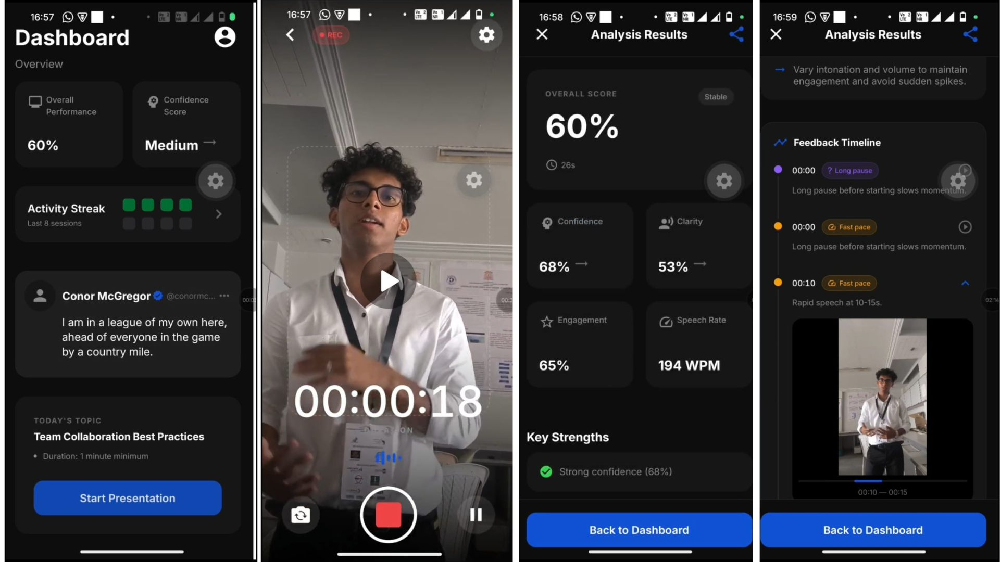

# Vision: AI-Powered Public Speaking Analysis

  
   
  <i>From left to right: User Dashboard, Real-time Recording, and Multimodal Analysis Results.</i>

## 🚀 The Vision

[cite_start]Public speaking is the \#1 fear worldwide[cite: 11]. [cite_start]**VisionCoach** is an intelligent multimodal coaching platform designed to transform subjective performance into objective, data-driven growth[cite: 70, 72]. [cite_start]By integrating computer vision and speech processing, we provide a private, always-available feedback loop that tells you exactly how you move and how you speak[cite: 11, 13].

-----

## 🛠️ Implementation Showcase

| **Recording Session** | **Posture Analysis** |
| :---: | :---: |
|  |  |
| [cite_start]*Step 1: Record your speech with live feedback[cite: 38].* | [cite_start]*Step 2: Real-time 33-landmark body tracking[cite: 25].* |

| **Acoustic Insights** | **Coaching Dashboard** |
| :---: | :---: |
|  |  |
| [cite_start]*Step 3: Filler word and pitch analysis[cite: 40, 50].* | [cite_start]*Step 4: LLM-generated action plans[cite: 42].* |

-----

## ✨ Key Features

  * [cite_start]**Multimodal Scoring:** Combines 10 pose metrics (posture openness, gesture quality) and 8 audio metrics (filler ratio, speech rate)[cite: 39, 40].
  * [cite_start]**AI Interpretation Layer:** Low-latency Groq LLM inference provides timestamped coaching notes and top 3 action items[cite: 28, 42].
  * [cite_start]**Longitudinal Tracking:** Compares current performance against Supabase-stored historical baselines to measure progress trends[cite: 32, 51].
  * [cite_start]**Edge Performance:** High-speed video compression (up to 80x reduction) and offline-first history browsing[cite: 33, 43, 61].

## 🏗️ Technical Stack

  * [cite_start]**Frontend:** React Native (Expo SDK 51), TypeScript, Zustand[cite: 59, 62].
  * [cite_start]**Backend:** Python / Flask 3.x with a modular pipeline architecture[cite: 56, 62].
  * [cite_start]**AI Engines:** MediaPipe (Pose), AssemblyAI (Transcription), Librosa (Acoustics)[cite: 25, 26, 27].
  * [cite_start]**Infrastructure:** Groq (LLM Inference), Supabase (PostgreSQL/Auth), Render (Hosting)[cite: 62].

## 🔄 The Workflow

1.  [cite_start]**Record:** High-fidelity video and audio capture via mobile[cite: 35].
2.  [cite_start]**Analyze:** Backend extraction of posture landmarks and acoustic features[cite: 87, 89].
3.  [cite_start]**Evaluate:** Score fusion and progress delta computation[cite: 91, 93].
4.  [cite_start]**Improve:** Receive a comprehensive coaching report in under 60 seconds[cite: 35].

-----

**Would you like me to help you draft the `config.py` structure or the pose normalization logic for the backend?**